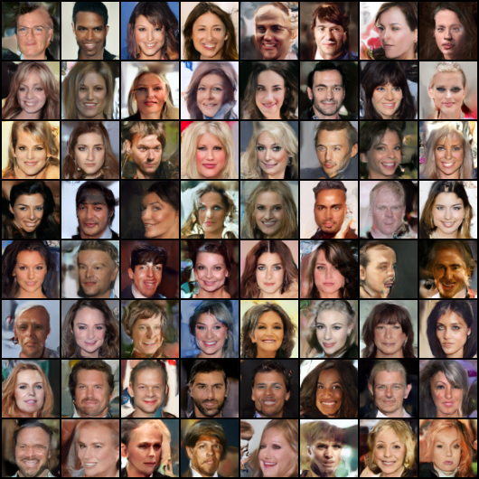
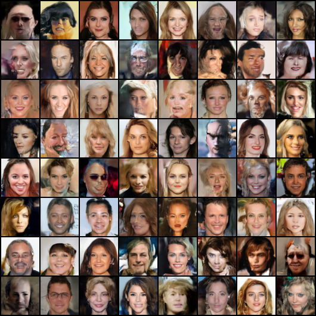

# Flow Matching on CelebA-HQ

Unconditional face generation using Conditional Flow Matching (CFM) — trained on CelebA-HQ 256 images resized to 64×64. Two backbones: a diffusers UNet and a DiT-style Vision Transformer.

| UNet (epoch 25) | ViT (epoch 100) |
|:-:|:-:|
|  |  |

---

## Setup

```bash
git clone https://github.com/harish-jhr/FlowMatching
cd FlowMatching
pip install torch torchvision diffusers accelerate tqdm Pillow numpy wandb
```

---

## Data

Point the training script at any flat folder of images. The dataloader resizes automatically. I used [CelebA-HQ](https://mmlab.ie.cuhk.edu.hk/projects/CelebA.html):

```
/path/to/data/
├── 00001.jpg
├── 00002.jpg
└── ...
```

---

## Train

```bash
# UNet
python train.py --backbone unet --data_root /path/to/data --batch_size 128 --epochs 300

# ViT
python train.py --backbone vit --data_root /path/to/data --batch_size 64 --epochs 300
```

Checkpoints are saved to `./checkpoints/` after every epoch. Training is logged to WandB
Resume from a checkpoint:
```bash
python train.py --backbone unet --resume ./checkpoints/unet_latest.pt
```

---

## Sample

```bash
python sample.py --backbone unet --checkpoint ./checkpoints/unet_latest.pt
python sample.py --backbone vit  --checkpoint ./checkpoints/vit_latest.pt
```

Saves a grid of 64 images to `./generated/`. Use `--solver heun --steps 50` for faster sampling at similar quality.

---

## Files

| File | What it does |
|------|-------------|
| `flow_matching.py` | OT-CFM loss, Euler and Heun samplers |
| `model_unet.py` | Diffusers UNet2DModel wrapper |
| `model_vit.py` | DiT-style ViT with AdaLN time conditioning |
| `train.py` | Training loop with EMA, AMP, wandb logging |
| `sample.py` | Generate images from a saved checkpoint |

---

## Reference

> Lipman et al., *Flow Matching for Generative Modeling*, ICLR 2023. [arXiv:2210.02747](https://arxiv.org/abs/2210.02747)
